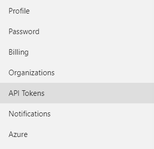
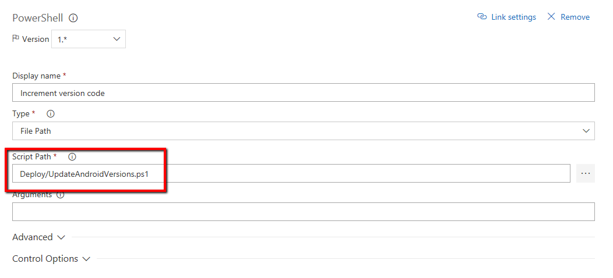

# Fast Track for Azure - Mobile DevOps

- [Fast Track for Azure - Mobile DevOps](#fast-track-for---mobile-devops)
  * [Introduction](#introduction)
  * [Pre-Requisites](#pre-requisites)
  * [API Access](#api-access)
  * [VSTS Setup](#vsts-setup)

## Introduction
In the walkthrough on [App Center](appcenter.md), we went through an end-to-end experience in creating a build / release process for a mobile application. However, there are times when we will want to build and test the app as part of a larger application, for example, also needing to build and deploy backend web services to accompany the app. We also saw that while we can invoke a run of our automated UI tests from the command line, we may want to have that automatically run during a release.

In these scenarios, we will want to create our own build and release pipelines. The walkthrough below uses Visual Studio Team Services (VSTS) to do just that. We will build the same app as the previous example but add in automated UI testing as part of our release phases.

## Pre-Requisites

This article assumes you have gone through the walkthrough in the original [App Center](appcenter.md) article.

You will need access to a VSTS account where you have permissions to create and edit a build and release definition.

## API Access

1) Navigate and login to the [App Center portal](https://appcenter.ms).
2) On the navigation pane, in the lower left hand corner, click your account name and then **Account Settings**.

    
3) In the *Settings* view, select **API Tokens** and then **New API Token**.

    .
4) Provide a description e.g. **VSTS Token** and access as **Full Access**. Click **Add new API token** and save the generated value for later.
    > Note: You will also need to store the name of your app for later, e.g. *Credit Card Validator*.

## VSTS Setup

1. Navigate to the **Code tab** inside of Visual Studio Team Services. Add a new folder called **Deploy** and upload the keystore file created in the earlier article.

    

2. To the **Deploy folder**, add a new PowerShell file called **UpdateAndroidVersions.ps1**
    * Add the following code to the PowerShell file
        ```powershell
        $files = gci $Env:BUILD_SOURCESDIRECTORY -Recurse -Include "*Properties*" | ?{ $_.PSIsContainer } | foreach { gci -Path $_.FullName -Recurse -Include AndroidManifest.* }
        
        if ($files)
        {
            Write-Verbose "Updating $($files.count) files";
            foreach ($file in $files)
            {
                $xml = [xml](Get-Content $file);
                $node = $xml.manifest;
                $versionCode = [int]((Get-Date).ToUniversalTime().ToString("yyMMddHHmm"));
                $node.SetAttribute("android:versionCode", $versionCode);
                $node.SetAttribute("android:versionName", $Env:BUILD_BUILDNUMBER);
                $xml.Save($file);
            }
        }
        ```

2. Navigate to the **Build tab** inside of Visual Studio Team Services. Create a new Build Definition.
    
    

3. Search for **Xamarin templates** in the search box, and select the **Xamarin.Android template**.
    
    

4. Once the definition, is created, remove the **Xamarin component restore** task as well as the **Xamarin Test Cloud** step.

5. Configure the build definition *Process* section with:
    * **Agent Queue:** Hosted VS2017

6. Navigate to the **Build Project** task. 
    * Configure Project to **CreditCardValidator.Droid.csproj**. If you do not complete this step, then you will likely encounter build failures, as the task will also attempt to build the Tests

7. Add an additional **Publish Artifact** task to the Build Definition.
    * Set **Path to publish** as **$(Build.SourcesDirectory)/CreditCardValidator.Droid/packages/**
    * Set **Artifact name** as **packages**

8. After the NuGet restore, add a new PowerShell task and configure it to invoke the PowerShell file we created to version the file.

    

9. Since this script users our VSTS build number for creating the display version for our users, we can adjust that in VSTS to our desired format.

    

10. In the **Android signing** step, enable the option to sign the APK. Assuming the keystore is the same as before, the parameters would be:
    * **Keystore File**: *Deploy/androidsigning.keystore*
    * **Keystore Password**: *Your keystore password*
    * **Alias**: *android*
    * **Key Password**: *Your keystore password*
    > Note: Best practice for storing the passwords would be to configure these as [secure variable in VSTS](https://docs.microsoft.com/en-us/vsts/build-release/concepts/definitions/release/variables) or use a service such as [Azure Key Vault](https://docs.microsoft.com/en-us/azure/key-vault/key-vault-whatis).

11. Save and queue the build. Congratulations, you have a working build! Go ahead and navigate to the **Releases** tab in the **Build and Release** section.

    

12. Create a new Release Definition, and start with an **empty process**.

13. Select **Artifacts** on the left hand side of the pipeline.
    * Click Add Artifact
    * Configure the **Source (Build Definition)** as the Build Definition that you had created earlier in this walkthrough
    * Click Add

14. Rename **Environment 1** to **Testing Environment.**
    * Create an *App Center Test task* in the Testing Environment.    
    

    * **Binary Application File Path**: Use the .apk file in your drop folder    
    * **Test Framework**: Xamarin UI Test
    * **Build Directory**: Typically along the lines of *$(System.DefaultWorkingDirectory)/**--Your Artifact Name--**/drop/test-assembly*
    * **Test Tools Directory**: Path to the Xamarin test tools in the packages artifact. Typically something similar to $(System.DefaultWorkingDirectory)/**--Your Artifact Name--**/packages/Xamarin.UITest.2.2.2/tools
    * **App Center Connection**: Click **New** and provide the API key from App Center generated earlier.
    * **App Slug**: The name of your app
    * **Devices**: Name of the device configuration you established.
    > Note: Values for *App Slug* and *Devices* can be obtained from configuring a Test Run in App Center. You will get a script similar to the following: `appcenter test run uitest --app "{organization}/Credit-Card-Validation" --devices "{organization}/pixel-devices" --app-path pathToFile.apk  --test-series "master" --locale "en_US" --build-dir pathToUITestBuildDir` Here we want the values used for `--app` and `--devices`
    * Once configured, click Save
    * Initiate a release

15. In the release pipeline editor, add another environment called **Testers**.

16. Add an *App Center Distribute* task to the environment.
    * Fill in the details for the App Center connection that was created earlier.
    * Use the same app slug as was used in the test environment.
    * Fill in the path to the .apk file from the attached artifacts
    * For release notes, add a comment that will be available to users of the app when they see that an update is available.
    * Save and initiate a release