# Fast Track for Azure - Mobile DevOps

- [Fast Track for Azure - Mobile DevOps](#fast-track-for---mobile-devops)
  * [Introduction](#introduction)
  * [Pre-Requisites](#pre-requisites)
  * [Code Setup](#code-setup)
  * [App Center Configuration](#app-center-configuration)
  * [Configure Build](#configure-build)
  * [Configure Test](#configure-test)
  * [Configure Distribution](#configure-distribution)
  * [Analytics and Telemetry](#analytics-and-telemetry)
  * [References](#references)

## Introduction

Managing quality across a variety of Mobile Applications is hard. During this walkthrough, we will develop the Credit Card Validator Android Xamarin sample. 

The main focus of this guide is to leverage Microsoft App Center as part of a DevOps pipeline. App Center will allow you to perform builds, UI Tests across a range of  physical devices, distribution to users, and telemetry reporting all from a single portal.

## Pre-Requisites
* You must have access and be able to deploy into a Microsoft Azure Subscription
* You must have access to App Center. You can [sign up for free](https://appcenter.ms/) which includes a 30 day access to the test cloud. You can sign up with a valid business e-mail address.
* You should have access to a Visual Studio Team Services Account. In particular, you should have access to a Team Project, where you can commit code, create and maintain Build / Release Definitions Find more information about [creating a VSTS account](https://docs.microsoft.com/en-us/vsts/accounts/create-account-msa-or-work-student).
* **Optional:** Access to a Visual Studio Client (2013, 2015, 2017) and have Xamarin tools installed.
    * [Visual Studio 2013/2015](https://developer.xamarin.com/guides/android/getting_started/installation/windows/#vs2015)
    * [Visual Studio 2017](https://developer.xamarin.com/guides/android/getting_started/installation/windows/#vs2017)
* The Java SDK is required to create a keystore for signing an Android app

## Code Setup

1. Download the [CreditCardValidatior.Droid.Zip file](https://github.com/xamarin/test-cloud-samples/raw/master/Quickstarts/downloads/CreditCardValidator.Droid.zip). Unzip the file.

2. Using the command line, navigate into the newly created folder. 
    * Initialise the repository using the `git init` command. 
    * Track changes of the files in Git by using the `git Add .` command.
    * Commit the changes by using `git commit -m "*Enter your message here*"`
    * Push the changes to the remote Git repository on your Visual Studio Team Services Team Project. You can find the location of the repository on the **Code** tab of your Team Project.
    
    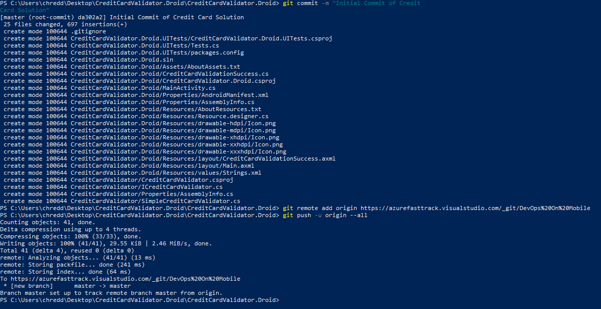

3. On your computer, we will now create the keystore / alias combination. Open a command prompt and type the following command (depending on the version of the JDK you have installed):

    ```
    "c:\Program Files\Java\jdk1.8.0_131\bin\keytool.exe" -genkeypair -v -keystore androidsigning.keystore -alias android -keyalg RSA -keysize 2048 -validity 10000
    ```

    Keep track of the password you used for the keystore as well as the password for the alias. This file will be uploaded to App Center when we setup our build.

## App Center Configuration

1. Log into [App Center](https://appcenter.ms).

2. In the **Add new** drop down, select **Add new organization**. Provide a name and then select **Add new organization**. Organizations must be unique.

3. Once in the organization, we will want to do some basic team setup. Select **People** from the navigation pane. In the people view, select **Teams** and then **Add new team**. Provide a team name e.g. *Credit Card Validation Team*. Once the team is created, feel free to invite additional collaborators to your team.

    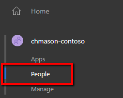

4. In the navigation pane, select **Apps** and click **Add new app**.

5. Fill in the details for the app and then click **Add new app**:
    * Name: *Credit Card Validation*
    * Description: Optionally fill details
    * OS: *Android*
    * Platform: *Xamarin*
    
    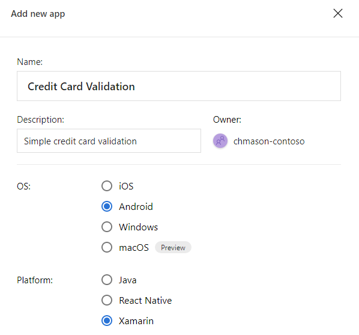

6. Once the app is created, we can associate it to the team. Navigate back to App Center's home, and then back to **People** in the navigation pane. Select **Teams** and the team created earlier.

7. From the team page, open the **Apps** view, click **Add app** and select the app created. In the **Role** dropdown, select **Developer**.

    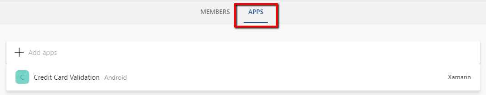

## Configure Build

1. Go back to the App Center home page, and select **Apps** from the navigation pane and select the app we created.

2. From the navigation pane, select **Build**. In the **Connect to repo** view, select **Visual Studio Team Services**. A list of accounts that your email has access to will be available. Select the team project containing your code, and then the repository.

3. Once connected, you will see a list of branches availale for you to work with, as of now, we only have *master*. Hover over the master branch and click the gear box icon that shows up.

    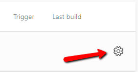

4. In the settings view, validate the correct settings:
    * Project: *CreditCardValidator.Droid.csproj*
    * Configuration: *Release*
    * Build frequency: *Build this branch on every push*
    * Automatically increment version code: Enable this switch
    * Sign builds: Enable this switch
    * Keystore file: Upload the keystore you created earlier and fill in the required parameters
    
    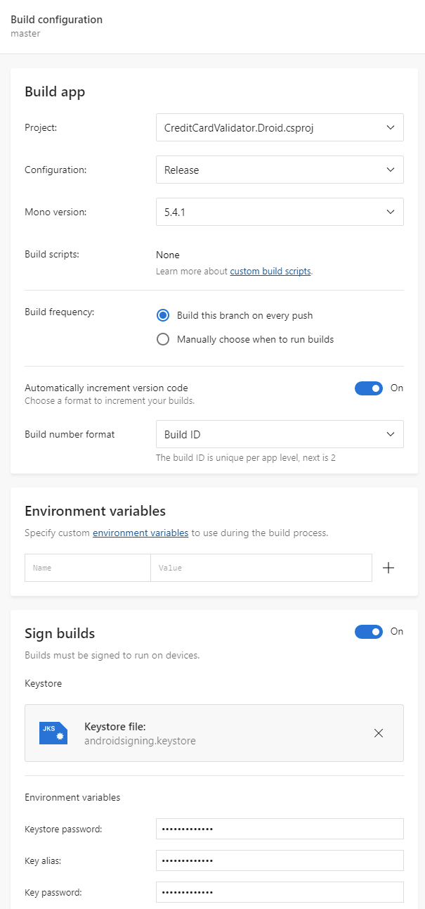

5. Save and build the project

## Configure Test

1. TBD

## Configure Distribution

1. In the app navigation pane, click the **Distribute** option.

    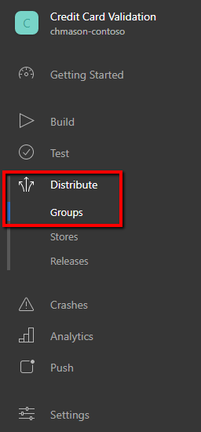
2. In the distribute view, select **Distribute new release**, select **Choose build from branch**.

    

3. Select the **master** branch, click **Next**.
4. Choose the build just created and click **Next**.
5. Click **Next** in the release notes.
6. For **Destination** click **Next**.
7. Finally click **Distribute**.
8. Once the app has been distributed, you should receive an email indicating a new build is available.
9. On the navigation pane, go back to the **Build** settings.
10. Flip the switch for **Distribute builds**. This will allow the app to automatically be distributed with a build is completed. Click **Save**.

## Analytics and Telemetry

1. In Visual Studio, open the *CreditCardValidator.sln* file.
2. Right click on the project, and select **Manage NuGet packages**.
3. Add the `Microsoft.AppCenter.Analytics`, `Microsoft.AppCenter.Crashes`, and `Microsoft.AppCenter.Distribute` packages.
4. In the App Center portal, navigate to the **Getting Started** view of your app. Copy the GUID assigned to your application.

    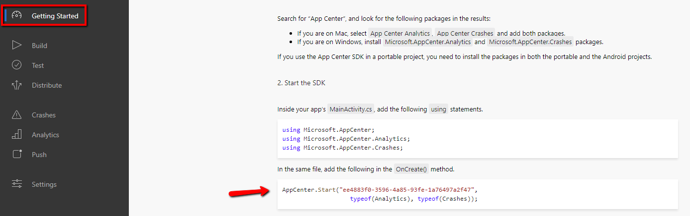

    > Note: The GUID shown here is specific for each application.
6. In **MainActivity.cs**, add the following code
    ```csharp
    using Microsoft.AppCenter;
    using Microsoft.AppCenter.Analytics;
    using Microsoft.AppCenter.Crashes;
    using Microsoft.AppCenter.Distribute;
    ```
    And in the **OnCreate** method, add
    ```csharp
    AppCenter.Start("YOUR_GUID",
        typeof(Analytics), typeof(Crashes), typeof(Distribute));
    ```
5. Open the **CreditCardValidationSuccess.cs** file.
6. At the end of the **OnCreate** method, add the following line:
    ```csharp
    throw new System.Exception("Example of App Center Crash Analytics");
    ```
7. Commit and push your changes to the Git repository on your Visual Studio Team Services Team Project.
    > Note: If you just run the application on the emulator it make take a couple of tries before metrics start to register with App Center.
8. Navigate back to App Center and the **Build** view and you should see your build started.
    
    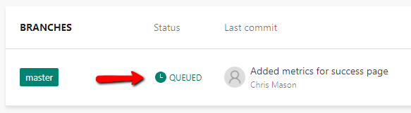

8. Navigate to App Center and to the **Crashes** view. You should see the details of the thrown exception showing up. You can click on the exception for more details.
9. Replace the **OnCreate** method with the following code
    ```csharp
    protected override void OnCreate(Bundle bundle)
    {
        var watch = System.Diagnostics.Stopwatch.StartNew();

        base.OnCreate(bundle);
        SetContentView(Resource.Layout.CreditCardValidationSuccess);

        watch.Stop();
        var elapsedMs = watch.ElapsedMilliseconds;

        Microsoft.AppCenter.Analytics.Analytics.TrackEvent(
            "Credit Card Validation Loaded",
            new System.Collections.Generic.Dictionary<string, string> { { "Load Duration", elapsedMs.ToString() } }
        );
    }
    ```
10. Commit and push your changes to the Git repository on your Visual Studio Team Services Team Project.
11. Navigate back to App Center and the **Build** view and you should see your build started.
    
    
12. Once the app is built, you should be able to open the application again on your device and see that an update is available.
13. Install the update and open the app again and complete the validation sequence.
14. Back in App Center, open the **Events** view on the navigation pane and you will see the *Credit Card Validation Loaded* custom event in there. Click the event to see more details on what was collected.
   
    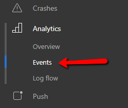
       
    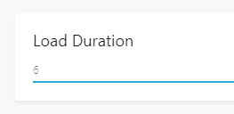
